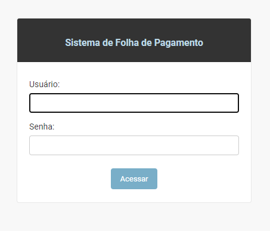
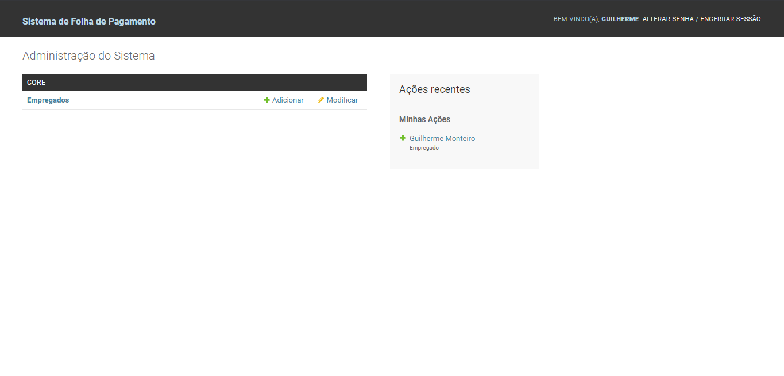

# Disciplina Projeto de Software

## _Sistema de Folha de Pagamento_

---------
To run the system:
```
C:\Users\...\payroll>python manage.py runserver

>
Watching for file changes with StatReloader
Performing system checks...

System check identified no issues (0 silenced).
June 07, 2021 - 10:26:57
Django version 3.2, using settings 'payroll.settings'
Starting development server at http://127.0.0.1:8000/
Quit the server with CTRL-BREAK.
```
Go to ```http://127.0.0.1:8000/``` and you will be directed to the login page. Only authorized employees can run the payroll and have access to the Employee CRUD.



To access the system:
```
Usuário: admin
Senha: 123456
```
The payroll system using Django is not complete, so it only has the function of registering, modifying and removing employees. For this, we use SQLite3.


---------
 O objetivo do projeto é construir um sistema de folha de pagamento. O sistema consiste do gerenciamento de pagamentos dos empregados de uma empresa. Além disso, o sistema deve gerenciar os dados destes empregados, a exemplo os cartões de pontos. Empregados devem receber o salário no momento correto, usando o método que eles preferem, obedecendo várias taxas e impostos deduzidos do salário.
 + Alguns empregados são horistas. Eles recebem um salário por hora trabalhada. Eles submetem "cartões de ponto" todo dia para informar o número de horas trabalhadas naquele dia. Se um empregado trabalhar mais do que 8 horas, deve receber 1.5 a taxa normal durante as horas extras. Eles são pagos toda sexta-feira.
 + Alguns empregados recebem um salário fixo mensal. São pagos no último dia útil do mês (desconsidere feriados). Tais empregados são chamados "assalariados".
 + Alguns empregados assalariados são comissionados e portanto recebem uma comissão, um percentual das vendas que realizam. Eles submetem resultados de vendas que informam a data e valor da venda. O percentual de comissão varia de empregado para empregado. Eles são pagos a cada 2 sextas-feiras; neste momento, devem receber o equivalente de 2 semanas de salário fixo mais as comissões do período.
 	+ Empregados podem escolher o método de pagamento.
	+ Podem receber um cheque pelos correios.
	+ Podem receber um cheque em mãos.
	+ Podem pedir depósito em conta bancária
 + Alguns empregados pertencem ao sindicato (para simplificar, só há um possível sindicato). O sindicato cobra uma taxa mensal do empregado e essa taxa pode variar entre empregados. A taxa sindical é deduzida do salário. Além do mais, o sindicato pode ocasionalmente cobrar taxas de serviços adicionais a um empregado. Tais taxas de serviço são submetidas pelo sindicato mensalmente e devem ser deduzidas do próximo contracheque do empregado. A identificação do empregado no sindicato não é a mesma da identificação no sistema de folha de pagamento.
 + A folha de pagamento é rodada todo dia e deve pagar os empregados cujos salários vencem naquele dia. O sistema receberá a data até a qual o pagamento deve ser feito e calculará o pagamento para cada empregado desde a última vez em que este foi pago.
